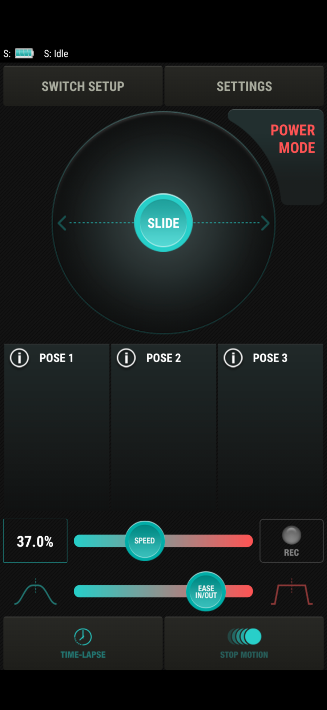

# Reverse engineering the [edelkrone SliderOne v2](https://edelkrone.com/products/sliderone-v2)

## Why do this?
The edelkrone "SliderOne v2" is a consumer-grade camera slider that uses BlueTooth. For many applications the 
app from the developer is sufficient. However for macro photography and [focus stacking](https://en.wikipedia.org/wiki/Focus_stacking)
the app falls short. The hope is to reverse engineer the bluetooth protocol used by the app & slider in order to 
enable simple 3rd party applications.

## Scope
The only functionality currently planned to replicate is
1. pairing with the device
2. moving the slider right and left

None of the motion planning features or parameter tweaking is currently in-scope. I'd like to start small :)
## Current findings
Logs have been collected from adb using logcat: `adb -d logcat BleService:D BLUETOOTH:D Joystick:D BleScanner:D '*:S'`
and the hci logging tools in android `adb bugreport {filename}`. Relevant logs have been put in the
[logs directory](./logs). Three different executions have been recorded, they all follow the same general pattern

1. Pair with the slider
2. Pan to the left

The hci logs are perhaps the most useful and a comparison of the three different runs is located in the 
[/logs/analysis](./logs/analysis) folder.

what follows is my analysis of the file:
***
Event 46 is where the logs first start to diverge and have different values
```
Event 46
log 1: source:Pixel 5	dest:SldrOne	opcode:BT_ATT_OP_WRITE_REQ	value:04:09:0c:b0:00:c9 -> decimal: 4, 9, 12, 176, 0, 201
log 2: source:Pixel 5	dest:SldrOne	opcode:BT_ATT_OP_WRITE_REQ	value:04:09:13:63:00:83 -> decimal: 4, 9, 19, 99, 0, 131
log 3: source:Pixel 5	dest:SldrOne	opcode:BT_ATT_OP_WRITE_REQ	value:04:09:16:91:00:b4 -> decimal: 4, 9, 22, 145, 0, 180
                                                                    value:04:09:29:93:00:c9 -> decimal: 4, 9, 41, 147, 0, 201
```
This appears to correspond to a:
```
01-17 13:57:06.998  5303  5303 D BLUETOOTH: Process Command: IO_CTRL
```
So I think this packet is like an 'init' message or something. It's the first meaningful data that's sent from the app
to the slider. Testing other commands on the slider seems to result in nothing.

last value is checksum?
```
decimal: 4, 9, 12, 176, 0, 201 -> 4 + 9 + 12 + 176 = 201
decimal: 4, 9, 19, 99, 0, 131 -> 4 + 9 + 19 + 99 = 131
decimal: 4, 9, 22, 145, 0, 180 -> 4 + 9 + 22 + 145 = 180
decimal: 4, 9, 41, 147, 0, 201 -> 4 + 9 + 41 + 147 = 201
```
is it time related?
```
Arrival Time: Jan 17, 2021 13:14:57.448195000 CST, epoch time: 1610910897.448195000 seconds
Arrival Time: Jan 17, 2021 13:43:32.493186000 CST, epoch time: 1610912612.493186000 seconds
Arrival Time: Jan 17, 2021 13:57:07.009962000 CST, epoch time: 1610913427.009962000 seconds
Arrival Time: Jan 18, 2021 00:24:20.916678000 CST, epoch time: 1610951060.916678000 seconds, 
```

## Next Steps?
Figure out that first command
